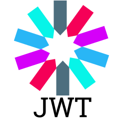

# Hi there 👋, I'm Lukas

## A software engineer from Vilnius, Lithuania

<!-- **LukasAstrauskas/LukasAstrauskas** is a ✨ _special_ ✨ repository because its `README.md` (this file) appears on your GitHub profile. -->

---

<!-- ? -->

 <!--  -->

## 🧰 Languages and Tools

 

#

#

<!--

---

## Badge

--- -->

Here are some ideas to get you started:

- 🔭 I’m currently working on ...
- 🌱 I’m currently learning ...
- 👯 I’m looking to collaborate on ...
- 🤔 I’m looking for help with ...
- 💬 Ask me about ...
- 📫 How to reach me: ...
- 😄 Pronouns: ...
- ⚡ Fun fact: ...

<h3>👨‍💻 More about me!</h3>

    Lorem ipsum dolor sit amet consectetur adipisicing elit. Explicabo recusandae
fugiat illo aspernatur adipisci quae at modi debitis vero aliquid. Amet
sapiente, doloremque consectetur maxime expedita asperiores aliquid molestias
ratione.
