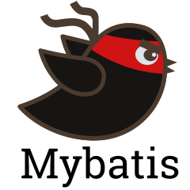

# Hi there 👋, I'm Lukas

## 👾 A software engineer from Vilnius, Lithuania

- 🔭 I’m currently working on personal project clinic-app [FE](https://github.com/LukasAstrauskas/Clinic-app-FE), [BE](https://github.com/LukasAstrauskas/Clinic-app-BE).
- 🌱 I’m currently learning Spring Security JWT, MySQL.
- 🤔 I’m looking for help with Docker, Kubernetes.
- 💬 Ask me about Java, Spring Boot.
- 📫 How to reach me: [Facebook](https://www.facebook.com/lukas.astrauskas.1/), [Linkedin](https://www.linkedin.com/in/lukas-astrauskas/)
- 😄 Pronouns: he/him.
- ⚡ Fun fact: I'm cycling enthusiast.

<!-- - 👯 I’m looking to collaborate on ... -->

## 🧰 Languages and Tools

 

#

 

#

 
 

<h3>👨‍💻 More about me!</h3>

        A very rational, sharp thinker, highly interested in learning new things. 
    Coding is my latest passion and I hope it will lead to working in this area. I am 
    a fast and eager learner, especially when the subject is interesting to me.
    I also have an exceptional sense of humor and love working with people 
    towards the same goal.
